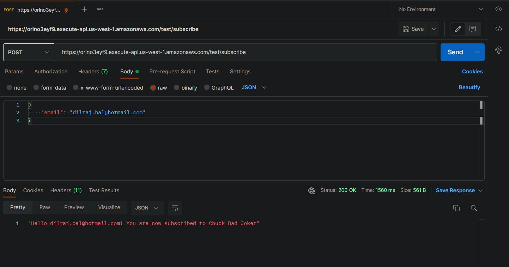
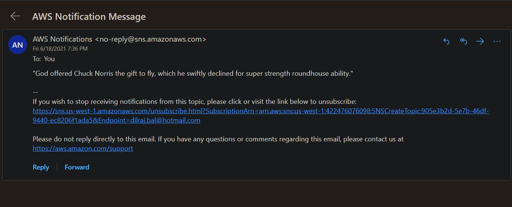

# BadJoker

A clouformation template that deploys two AWS lambda functions, assigns IAM roles, grants neccessary permissions, sets up an API and SNS topic.

 

To test this stack, upload the CF_BadJoker template to AWS cloudformation Designer and click create stack. Cloudformation will create all the components of
this stack. Next to test the stack, retrieve the API url from API gateway make a POST request like described in the image below. If successful, you will
receive a confirmation like one at the bottom of the image:

 
Next, the subscribed email will receive a confirmation notification. Once subscribed, the user will receive periodic notification with a joke:

